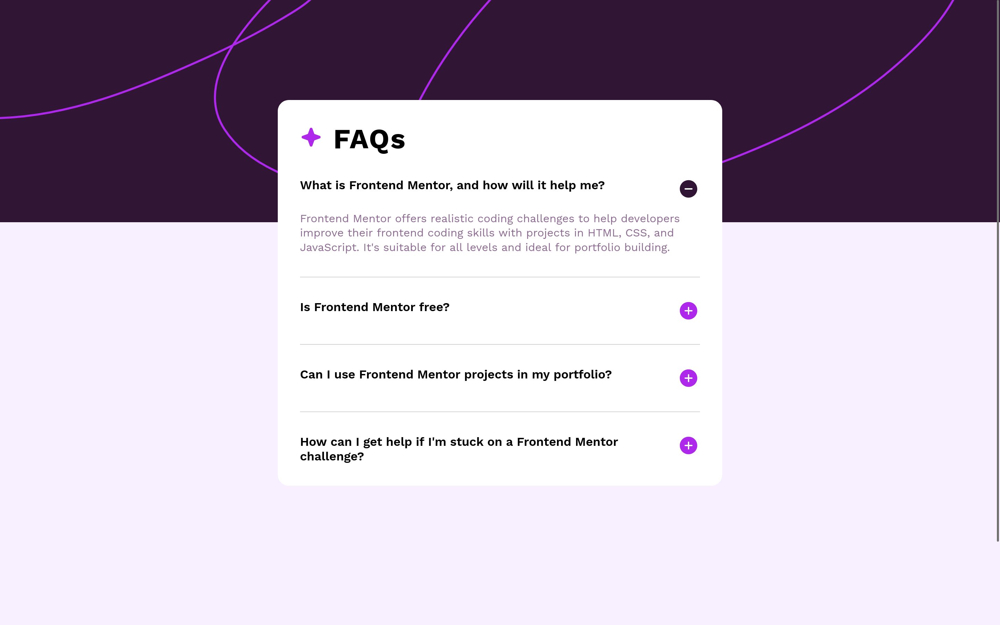
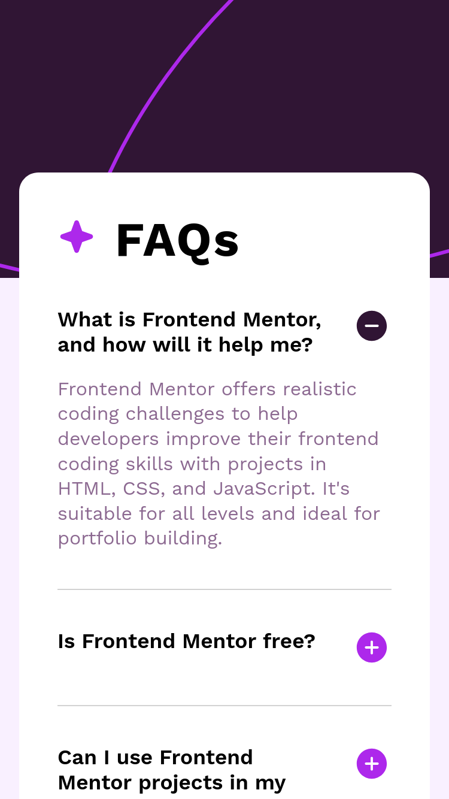

# Frontend Mentor - FAQ accordion solution

This is a solution to the [FAQ accordion challenge on Frontend Mentor](https://www.frontendmentor.io/challenges/faq-accordion-wyfFdeBwBz). Frontend Mentor challenges help you improve your coding skills by building realistic projects. 

## Table of contents

- [Overview](#overview)
  - [The challenge](#the-challenge)
  - [Screenshot](#screenshot)
  - [Links](#links)
- [My process](#my-process)
  - [Built with](#built-with)
  - [What I learned](#what-i-learned)
  - [Continued development](#continued-development)
- [Author](#author)

**Note: Delete this note and update the table of contents based on what sections you keep.**

## Overview

### The challenge

Users should be able to:

- Hide/Show the answer to a question when the question is clicked
- Navigate the questions and hide/show answers using keyboard navigation alone
- View the optimal layout for the interface depending on their device's screen size
- See hover and focus states for all interactive elements on the page

### Screenshot

### Links

- [Solution Repo (code)](https://github.com/IbrahimMurad/faq-accordion)
- [Live Site](https://ibrahimmurad.github.io/faq-accordion/)

## My process

### Built with

- Semantic HTML5 markup
- CSS custom properties
- Flexbox
- CSS Grid
- Mobile-first workflow
- Vanilla JavaScript
- Sass

### What I learned

Throughout this project, I gained a deeper understanding of accessibility and WAI-ARIA practices. Implementing these techniques helped improve the user experience, especially for users relying on assistive technologies.

### Continued development

In future projects, I plan to focus more on accessibility and WAI-ARIA practices to ensure a better user experience for all users.

## Author

- [Email](mailto:ibrahimmorad31@gmail.com)
- [LinkedIn](https://www.linkedin.com/in/ibrahim-morad-228410209/)
- [Frontend Mentor](https://www.frontendmentor.io/profile/IbrahimMurad)
- [Github](https://github.com/ibrahimmurad/)
- [Discord](https://discord.com/users/ibrahimmorad)